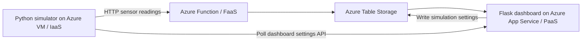

# Smart Street Lighting

Azure IoT simulation and an operations dashboard for five streetlights, produced by **anksax** (Ankur Ashish Saxena) for Fundamentals of IoT and Cloud Computing.

## Features

- Five selectable lamps, live connectivity, ON/DIM/OFF states and commanded brightness.
- Light and dark dashboard themes, with a browser-local theme preference.
- Daylight street background at ambient light of 300 lux or above, independent of dashboard theme.
- Selected-lamp lux, motion, decision reason and last received telemetry.
- Cloud-stored brightness history: up to 120 readings per lamp from the last 15 minutes.
- Password-protected daylight, empty-night and movement presets.
- Missing telemetry and failed-request indicators, responsive layout and keyboard controls.
- Visible “Produced by anksax” attribution and managed identity access to storage.

## Azure architecture



The VM polls `/api/settings`, simulates five sensors and posts readings to the existing Function with the `x-functions-key` header. The Function processes telemetry and stores it; the dashboard reads storage using its App Service managed identity. Dashboard controls write to the Settings table after validating the control password.

The stateful HTTP Function source is included under functions/. Deploy it explicitly with deploy-function.sh to enable motion hold and hysteresis.

Existing resource names used by the deployment script:

| Resource | Name |
| --- | --- |
| Resource group | `smart-streetlight-rg` |
| Storage account | `streetlightstorage` |
| Function App | `streetlight-func` |
| Dashboard Web App | `streetlight-dashboard` |

Tables: `Readings`, `LampState`, `Settings`, `Alerts`. Alerts is reserved for future fault detection. The dashboard identity needs Storage Table Data Reader at storage-account scope and Storage Table Data Contributor at Settings-table scope. The Function identity needs Storage Table Data Contributor. These resources and permissions must already exist; the script does not provision them.

### Expected data contract

`Settings` uses PartitionKey `simulation` and RowKey `global`, with `hour`, `lux`, `activity_lamp` (0–5) and `follow` (boolean). `LampState` uses lamp IDs `L01`–`L05` as PartitionKey and `latest` as RowKey. `Readings` uses the lamp ID as PartitionKey and a sortable UTC timestamp RowKey in `YYYYMMDDTHHMMSSffffff` format. Telemetry fields are `received_at` (timezone-aware ISO timestamp), `ambient_lux`, `simulation_hour`, `motion`, `state`, `brightness` (0–100) and `reason`.

## Setup

Requires Python 3.10+ and access to the existing Azure deployment.

```bash
git clone https://github.com/anksax/smart-streetlight.git
cd smart-streetlight
python -m venv .venv
# Linux/macOS: source .venv/bin/activate
# PowerShell: .\.venv\Scripts\Activate.ps1
python -m pip install -r dashboard/requirements.txt -r simulator/requirements.txt
```

Copy `.env.example` to an ignored local `.env` and replace its placeholders. These programs read process environment variables; they do **not** automatically load `.env`. Export the required values in your terminal or configure them through your hosting environment without committing them.

| Variable | Used by | Purpose |
| --- | --- | --- |
| `TABLE_STORAGE_ENDPOINT` | Dashboard | Table Storage HTTPS endpoint |
| `DASHBOARD_CONTROL_TOKEN` | Dashboard | Private password required for settings changes |
| `STREETLIGHT_URL` | Simulator | Existing Function HTTP endpoint, without a key in the URL |
| `STREETLIGHT_KEY` | Simulator | Function key sent as a request header |
| `DASHBOARD_URL` | Simulator | Dashboard base URL |

### Dashboard

```bash
python -m flask --app dashboard/app run
```

Open `http://127.0.0.1:5000`. The page can render locally, but storage API requests require an Azure managed identity. The included dashboard deliberately uses `ManagedIdentityCredential`; to develop against Azure from a workstation, adapt the credential to a suitable local Azure credential and authenticate with the required table permissions. Never insert credentials into source files. The control password remains in page memory and is not saved in browser storage.

### Simulator

Set `STREETLIGHT_URL`, `STREETLIGHT_KEY` and `DASHBOARD_URL` in the simulator environment, then run:

```bash
python simulator/simulator.py
```

It sends five readings concurrently on a two-second cycle. Stop with Ctrl+C. Follow mode activates the chosen lamp and up to two subsequent lamps. Enable Automatic demo and apply settings to cycle a full day in 120 seconds and move activity every six seconds. Disable it and apply settings to return to manual controls. Avoid duplicate simulators: stateful hold and hysteresis assume one ordered producer per lamp.

## Dashboard deployment

GitHub publication does not update Azure. To deliberately deploy a release later, use Azure Cloud Shell (Bash) or a Bash environment with Python 3 and Azure CLI, sign in to the intended subscription, and run from this repository:

```bash
az login
az account show
bash deploy-dashboard.sh
```

The script packages only the five dashboard runtime files into ignored `dashboard.zip`, enables remote dependency installation, sets `TABLE_STORAGE_ENDPOINT`, configures Gunicorn and ZIP-deploys the existing Web App. It changes that Web App's settings and deployment only. Existing managed identities, roles, `DASHBOARD_CONTROL_TOKEN` and deployment basic authentication settings are left in place. Set the control token privately in App Service configuration if it is missing. No Azure deployment is performed by publishing this repository.

After an intentional deployment, verify the page, `/api/state`, lamp history, theme toggle and password-protected presets. Confirm the VM produces fresh readings and that incorrect passwords cannot change settings.

## Data interpretation

ONLINE means telemetry arrived within 45 seconds. Offline brightness is the last-known command. Mean brightness includes stale reported commands and is not an energy measurement. Environment settings can update before the VM's next sensor cycle. The background uses the latest online lux telemetry; actual brightness comes from the Function. Smooth glow animation represents commanded brightness, not measured electrical output.

## Security and checks

Keep passwords, Function keys, private keys, `.env` files, caches and generated ZIPs out of Git. `.env.example` contains placeholders only. `.gitignore` excludes common sensitive and generated files; the deployment archive uses an explicit runtime-file allowlist. Review staged files before publishing.

Syntax checks:

```bash
python -m compileall -q dashboard simulator
node --check dashboard/static/app.js
bash -n deploy-dashboard.sh
```

Cloud connectivity and the external Function must be verified in Azure separately. Function source and decision tests are included under functions/. Browser rendering and live Azure connectivity still require deployment verification.

## Reactive lighting upgrade

Deploy all three components to enable the complete feature set. Publishing to GitHub alone does not deploy Azure.

1. In Azure Cloud Shell, run `bash deploy-function.sh` to replace the existing HTTP Function with the included stateful lighting implementation. Existing managed identity and TABLE_STORAGE_ENDPOINT settings are required.
2. Run `bash deploy-dashboard.sh`.
3. Copy `simulator/simulator.py` to the VM's `~/smart-streetlight/simulator.py` and restart `streetlight-simulator`.
4. Hard-refresh the dashboard. Enter the control password, enable Automatic demo and Apply scenario.

Lighting rules:
- First reading: original 300-lux OFF threshold.
- Once OFF: remain OFF until lux falls below 280.
- Once lighting is active: remain active until lux reaches 300.
- Motion keeps a lamp ON and refreshes a 12-second server-time hold.
- After motion ends, ON lasts until the hold expires, then DIM.
- Daylight immediately cancels a hold and switches OFF.
- Manual presets disable automatic mode; activity hold can still take 12 seconds to clear.

This changes boundary-test expectations: a 299-lux reading after daylight remains OFF. Test thresholds with the previous state recorded. Existing Readings and LampState tables are reused; no new roles or tables are required. The timer persists in LampState across Function restarts; automatic demo position restarts when the simulator restarts.

Verification:
```bash
python3 -m unittest discover -s functions -p 'test_*.py'
```
Check a full automatic cycle, move activity, stop activity and observe hold expiry, then cross 280/300 lux in both directions. Verify wrong passwords still return 401 and negative lux returns 400. Do not treat local decision tests as evidence that Azure deployment succeeded.

Limitations: no physical sensors, measured energy, fault alerts or manual per-lamp override in this release. The GitHub Pages standalone demo remains separate and uses its original stateless rules.

## Assignment acceptance testing

See [TESTING.md](TESTING.md) for requirements mapping, screenshot evidence and reproducible tests. Run `python3 tests/live_acceptance.py` on the VM with the simulator environment variables exported to generate CSV/JSON actual results. Deploy the latest Function and dashboard first. Local tests and CI do not certify live Azure connectivity.
